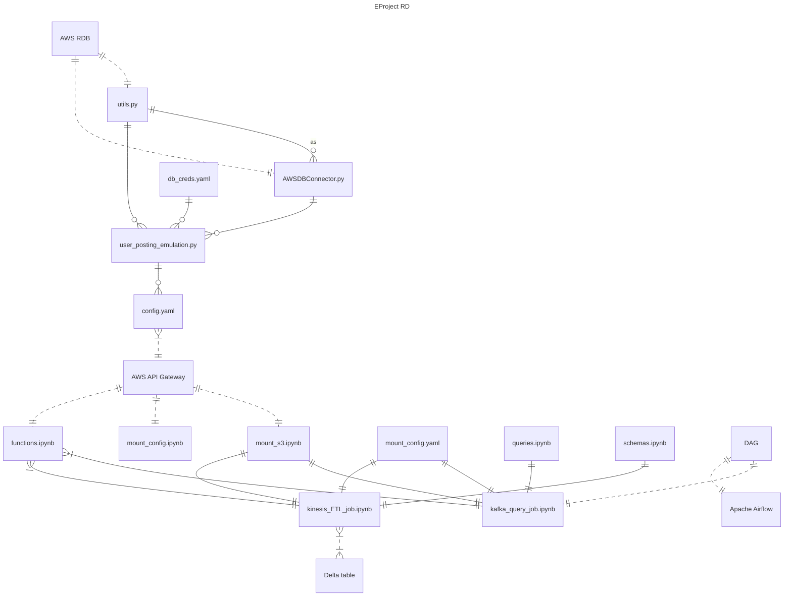

# Pinterest Database Pipeline

### Description
This project showcases the building of a Pinterest-type data pipeline from scratch, complete with streaming processing, ETL, and workflow automation using AWS and various Apache tools.  Thanks for viewing!

#### Dependencies (locally)

```
yaml
sqlalchemy
```

Licensing A. Close, with thanks to AICore for generated user posts.

### Table of Contents

- [Introduction](#introductionntroduction)
- [Overview of file structure](#overview-of-file-structure)
- [Entity relationship diagram](#entity-relationship-diagram)
- [Some gritty details](#gritty-details-project-logbook)


### Introduction
Briefly, simulated user posting data is ingested from a remote database through a python script.  The script interacts with one of two different APIs set up on AWS Gateway:  one corresponding to processing through Apache Kafka on an AWS EC2 instance, and one to AWS Kinesis.

These streaming processors are interacted with by Databricks notebooks that clean and transform the posting data before performing specialised operations:  the notebook handling the Kafka stream performs Spark SQL-type analytical data mining operations (the whole of which process is automated to run daily using Apache Airflow), while the the notebook handling the Kinesis stream sets up a mechanism to write the transformed data to the Databricks Delta table (completing the full ETL process).

### Overview of file structure

The master file of the local setup is `user_posting_emulation.py`.  Herein is written a script which, when run as `__main__`, generates an infinite streaming of data simulating user posts on the Pinterest website.  The data comes in three forms which will be referred to throughout by: 
- `pin` (information on the content of the Pinterest post itself);
- `geo` (geographical data linked to the individual post);
- `user` (data concerning the user who has posted).

The script calls on: 
- a class written in `AWSDBConnector` which connects to the remote database where this simulated data is kept and randomly samples it;
- various utility functions in `utils.py`, the more important of which send to a Kafka or Kinesis stream (assigning a topic for each of the three data forms) through APIs configured on AWS Gateway;
- `db_creds.yaml` and `config.yaml` wherein can be found sensitive credentials and constants relating to the post generator and AWS endpoints, respectively.

Within the `databricks_jobs/` directory there are various notebooks relating operations performed on Databricks, exported to Jupyter format.  Chiefly, `kafka_processing_job.ipnyb` and `kinesis_ETL_job.ipynb` contain the streamlined code which executes all relevant ETL processes and analytically querying.  Then there are:
- `mount_s3` (in turn require `mount_config.yaml`) and `functions` which contain AWS connection code and custom functions, respectively; both run by the chief notebooks;
- `queries.ipynb`  which outsources the Spark-SQL query code; run by the Kafka notebook;
- `schemas.ipynb` where manual table schema information is located; run by the Kinesis notebook;

Finally, `<...>_dag.py` contains the DAG used to create a once-daily automated running of the Kafka notebook using Apache Airflow.

### Entity relationship diagram



### Gritty details (project logbook)

#### Configuring Kafka to use the MSK authenticator
In `usr/local/kafka/bin`, the client.properties file is already there and the `security.protocol`, `sasl.machanism`, and `sasl.client` variables are already set to `SASL_SSL`, A`WS_MSK_IAM`, and `...`, respectively.  So only the `sasl.jaas`... configuration needs to be modified to the full AWS Role ARN.

Then the MSK authenticator package is installed on the EC2 instance in `kafka/libs`, using `wget`.  This `.jar` file is referred to globally and in all subsequent sessions by exporting the `CLASSPATH` variable and writing this export to the `~/.bashrc` file.

#### Creating Topics
AWS CLI was not permissible, so within the AWS MSK console I find the Pinterest cluster and its ARN, and locate the Bootstrap server and Zookeeper connector strings.  These are noted down in my `creds` file.

Using the Kafka `--create --topic` command, I create three topics associated with the three incoming Pinterest data streams:  `user`, `geo`, `pin`.

#### Custom MSK plugin
I find the pre-existing S3 bucket associated with my user ID.

I download the Confluent.io AWS connector (the installation commands are saved in a some_code file on `~` of the EC2 machine:  the endpoint URL had to be updated) and copy the `.tar` file to the S3 bucket found above, using `aws s3 cp`.

Then, within the MSK console on AWS, I create a custom plugin associated to my username by locating the `.tar` object in the S3 bucket.

Finally, I create a Connector using this plugin again in th MSK console.  I use all the recommended config settings from the course notebook.


#### Creating an API gateway
An API for sending incoming Pinterest data to the MSK cluster is pre-built and named with my user ID and it's viewable in the AWS API Gateway console.

I create a resource on this API with path `/` and name `{proxy+}` to allow me to build API methods.  One method I build is the HTTP ANY method: editing the ANY integration, selecting HTTP ANY type, and using as the Endpoint URL the 'Public IPv4 DNS' address listed under my EC2 instance (noted in the `creds` file).

(I had to put `http://` in front of the endpoint to be valid. **NOT** `https`!)

I keep the rest of the parameters default.  Deploying the API, I make note (in the `creds` file) of the 'Invoke URL'.

#### Setting up the REST proxy on the EC2 instance
Downloading the full Confluent package to the EC2 machine (having first removed the `kafka-connect-s3` directory and flushing the logs, etc, because the machine ran out of space...), I install the `.tar.gz` file and modify the `kafka-rest`.properties file.

This looks similar to the `client.properties` file.  I put in my Role ARN as before, and include the Bootstrap and Zookeeper strings obtained earlier.

Run the REST proxy by `confluent-7.2.0/kafka-rest-start <pwd to .properties file>`.  Everything OK and server is "listening for requests".

#### Python script to emulated Pinterest posting
The file `user_posting_emulation.py` contains a script that gathers data (as three RDB tables 'pin', 'geo', 'user'), extracts random rows, and prints them out in an infinite loop. 

My goal is to modify these to send the data for consumption by Kafka via the REST proxy.  I do this by changing the `run_infinite_post_data_loop()` method so that a requests payload is defined for each extracted table row, and at the end of the operation they are all posted to the relevant Kafka topic by tweaking the Invoke URL, adding '`/topics/<UserId>.pin`', etc.

Important to note that, because the SQL query result (now converted to `dict` type) is put in a requests payload using the j`son.dumps()` method, I needed to convert any datetime entries to a JSON-serialisable format first.  This was so I could just read the dictionary into the value key of the json.dumps() method.  Otherwise I would need to put in all the entries one by one.  My method is neater than this and handles future changes to the column values.  (Datetime format data only appears in `geo` and `user` data, but the conversion is included for all three sources for consistency and to guard against future inclusion in the `pin` source.)

#### Mounting the S3 bucket in Databricks
After importing the credentials (access and secret access keys) I mount the S3 bucket under a mount called `<UserId>-mount`.  My bucket file system is there as expected when running `display(dbutils.fs.ls("/mnt/126ca3664fbb-mount/"))`.  Reading in the data as a dataframe goes according to plan.  Thy are titled `df_pin`, etc.

The code for this is stored in the 'Mount & clean S3 data' Databricks notebook.

#### Cleaning, transforming & querying
In the same notebook there is which extracts the data into three dataframes for `pin`, `geo` and `user` data.  There follows some code to clean the data (removing nulls, converting strings into `int`s and `datetime`s, tidying the filepaths) and to transform he column order of the dataframes.

After this is down, various scripts are given to query the data in pyspark code and return the output into dataframe format.  These are all successful.

#### AWS MWAA
I tweak the Databricks notebook so that it all runs in one go smoothly (the mounting command needs to be commented out as this will stop the run if already mounted).  This final `.ipynb` file is now added to my Git repo.

I create a Databricks workflow job which, when triggered, will run this notebook.

Next I create my DAG in the file `<UserId>_dag.py`.  This defines the DAG `<UserId>_dag`, configured to run the above Job (via its job ID) daily at midnight. Uploading this dag to the correct AWS S3 bucket, locating it in the Airflow UI, and manually triggering it results in a successful run (after a few modifications)!  The DAG code is also pushed to Github.

#### Kinesis setup
In the AWS Kinesis console I create a data stream for each incoming table, named `streaming-<UserId>-pin`, etc.

On my previously built REST API, I create the resource streams, which has its won GET method (to list all Kinesis streams).

Then I add the `stream/{stream-name}` resource which itself has GET, POST and DELETE methods (describing, creating and deleting streams, respectively). 

Finally, I create `/stream/{stream-name}/record` and `.../records` resources, which each have a PUT method (to write a datum/data to a particular stream).

The methods are configured so that `{stream-name}` in the invoke URL is replaced with the `StreamName` value in the request payload, and so that the payload `Data` itself is encoded in base64.

A test request is contained in the file `test_stream_post.py`.  The status response code is 200! -- However, I cannot see the data recorded in the Kinesis data viewer...

To simulate incoming user posting data, a new file `user_posting_emulation_streaming.py` is created, which is a modification of the `user_posting_emulation.py` adapted for Kinesis and to interact with the `stream/{stream-name}/record` PUT method.  ~~The code appears to be successful (200 response codes) but again I cannot see any records on the data viewer.~~  Working.  Potential issues were:  Kinesis itself (janky to see records - need to select `from timestamp`); and `Content-Type` header should be `application/json`, not the `x.amz` one.

#### Kinesis & Databricks
In Databricks a new notebook 'Kinesis streaming' (exported and added to Git repo as `kinesis_streaming.ipynb`) is initiated.  In the same vain of the S3 bucket mounting, the access and secret access keys are read from the credentials file.  When the emulator is running, the stream data are read into three DataFrames, which will update with new row entries as long as the cell remains uninterrupted.  To see the data properly the `data` field needs to be decoded (from base64).

I copy my cleaning/transforming code from the other notebook and bung it in one cell of this streaming notebook.

~~As of right now I cannot check if the transformations work properly on df_pin because there is a stray data entry at the very start corresponding to a test payload I sent when first trying out the stream.  My functions will not work on it as this item doesn't follow the expected schema.  Rather than try to remove this datum I will just wait for the stream data to flush (after 24 hours) and run the stream & notebook then.~~

~~And waiting again because emulator was accidentally sending `"Data": {"index": <data>}` as payload instead of `"Data": <data>` !~~

Emulator data now fixed.

Withing the notebook this data arrives as a base64 encoding of a JSON string.  I can put it back to the JSON by using `.cast('string')` or `.selectExpr("CAST(data as STRING)")`.  Since the schema is the default Kinesis one (columns `partitionKey`, `data`,...) I pick out the `data` column and convert it using `from_json(col("data")` for each dataframe (`pin`,`geo`,`user`).  For this to work I have to manually construct a schema which is unsatisfactory but it works.  The resulting parsed dataframes have the correct column headings and data extracted from the JSON string.

I can then transform the streamed dataframes using all my cleaning/manipulations from before.  They run without issue.

Finally, I write the dataframes to Databricks using:

`.writeStream.format("delta") .outputMode("append").option("checkpointLocation", "/tmp/kinesis/_checkpoints/").table("126ca3664fbb_pin_table")`

etc.  I can see these tables now in the 'catalogue'!
